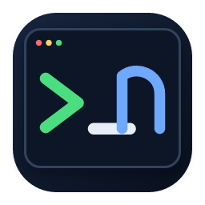

# CNshell

<p align="center">
  
</p>

CNshell 是面向 macOS 与 Windows 的 SSH、SFTP、Linux 监控和 RDP 工作区。它将远程终端、文件管理、服务器状态与连接资料集中在一个原生桌面应用中。

> [!WARNING]
> `v0.2.0-beta.1` 是未做商业代码签名的跨平台预发布版。macOS 包采用 ad-hoc 签名且没有 Developer ID/公证；Windows 安装包没有 Authenticode，x64 为 Beta、ARM64 为 Preview。只从本仓库 Release 下载并先核对 `SHA256SUMS.txt`。不要关闭 Gatekeeper、SmartScreen 或其他系统安全功能。updater minisign 只验证更新归档，不能替代操作系统代码签名。

## 下载

- [打开 CNshell v0.2.0-beta.1 预发布页](https://github.com/YaphetS0903/CNShell/releases/tag/v0.2.0-beta.1)
- [下载 macOS universal DMG](https://github.com/YaphetS0903/CNShell/releases/download/v0.2.0-beta.1/CNshell_0.2.0-beta.1_universal.dmg)
- [下载 Windows x64 Beta](https://github.com/YaphetS0903/CNShell/releases/download/v0.2.0-beta.1/CNshell_0.2.0-beta.1_x64-setup.exe)
- [下载 Windows ARM64 Preview](https://github.com/YaphetS0903/CNShell/releases/download/v0.2.0-beta.1/CNshell_0.2.0-beta.1_arm64-setup.exe)
- [下载 SHA256SUMS.txt](https://github.com/YaphetS0903/CNShell/releases/download/v0.2.0-beta.1/SHA256SUMS.txt)
- macOS 系统要求：macOS 13 Ventura 或更高版本；支持 Apple Silicon 与 Intel Mac
- Windows 系统要求：Windows 10 22H2（build 19045）或 Windows 11；目标架构为 x64 与 ARM64 Preview

macOS 首次启动前先核对哈希，再在 Finder 中对 CNshell 使用右键“打开”。不要执行 `xattr -cr`，也不要关闭 Gatekeeper。Windows 若显示 SmartScreen“未知发布者”或信誉提示，只能在仓库来源和哈希都正确时继续；不要关闭 SmartScreen。

DMG 已包含 universal FreeRDP 客户端；Windows 安装包会包含对应架构的 FreeRDP、Mosh 与 G-Kermit。SSH、SFTP、监控和 RDP 不要求用户安装 Homebrew、WSL、MSYS2 或开发环境。

## 安装

1. 下载 `CNshell_0.2.0-beta.1_universal.dmg` 和 `SHA256SUMS.txt`，核对 SHA-256 后打开 DMG。
2. 将 `CNshell.app` 拖入“应用程序”。
3. 在 Finder 中打开“应用程序”，首次启动时选择 CNshell 并使用右键菜单中的“打开”。
4. 仔细阅读 macOS 的来源提示；只有确认 DMG 来自本仓库发布页时才继续。
5. 创建 SSH 连接后，通过云控制台或管理员提供的可信渠道核对首次显示的 SHA-256 主机指纹。

不要使用 `xattr -cr`、关闭 Gatekeeper 或其他全局绕过安全检查的命令。升级、数据保留和完整卸载步骤见 [安装文档](docs/INSTALLATION.md)。

## 主要功能

### 终端与连接

- SSH 密码、私钥、SSH Agent、严格主机指纹校验、代理、跳板机与端口转发
- 多标签终端、任意嵌套拆分、搜索、Copy Mode、快捷命令、自动重连与会话日志
- OpenSSH config 导入、Ed25519 密钥生成与公钥部署
- 多主机批量执行、危险命令确认与受限自动化任务

### 文件与服务器

- SFTP 目录树、后台上传下载、暂停、重试、冲突策略与文件夹传输
- CodeMirror 远端文本编辑、原子保存、外部修改检测与三方冲突处理
- Linux CPU、内存、Swap、网络、进程、磁盘、延迟与系统信息
- 进程管理、Socket 列表、Ping 和 Traceroute 诊断

### 桌面与数据

- 内置 macOS universal 或 Windows x64/ARM64 FreeRDP，RDP 凭据不进入命令参数或环境变量
- 连接文件夹、软删除、macOS Keychain/Windows 凭据管理器、加密备份与加密同步
- 浅色、深色和高对比主题，终端字体、字号、光标与配色偏好
- 脱敏诊断导出；默认不上传遥测、终端内容、连接资料或崩溃信息

### 团队与扩展

- Ed25519 签名 WASM 插件、逐项权限确认、无 WASI 沙箱与有界宿主接口
- 在线团队工作区、设备身份、端到端加密连接文件分享和只转发密文的自托管 relay
- 在线多人终端：默认只读观看、按设备邀请、断线补帧和 10–300 秒单设备控制权移交
- Owner/Admin 组织目录导出，以及 relay 健康、就绪和 Prometheus 指标端点

## 安全与隐私

- 密码、私钥口令和代理密码保存在 macOS Keychain 或 Windows 凭据管理器，不写入 SQLite 或诊断文件。
- 首次连接必须确认服务器指纹；已记录的指纹发生变化时会阻止连接。
- 普通安全导出不包含凭据；包含凭据的备份使用 Argon2id 与 AES-256-GCM 加密。
- 当前版本没有遥测 SDK，不会自动上传命令历史、终端内容或崩溃信息。

详细边界见 [安全说明](docs/SECURITY.md) 和 [隐私说明](docs/PRIVACY.md)。

## 已知限制

- 当前 Beta 未完成 Developer ID 签名、公证和正式自动更新通道。
- RDP 采用独立 FreeRDP 窗口深度联动（状态、定位、聚焦/隐藏、全屏、显示器、缩放、画质、剪贴板、音频和目录映射）；由于嵌入画面会破坏 SDL 原生输入与 sidecar 崩溃隔离，暂不把像素强行搬进 WebView。
- Windows 10/11 x64、Windows 11 ARM64、真实 Windows RDP、Intel Mac、Ventura/Sonoma/Sequoia、完整弱网和 VoiceOver/Narrator 真机矩阵仍待扩大；ARM64 在原生验收前保持 Preview。
- Zmodem 已完成 `lrzsz` 双向互操作，Mosh 已完成真实公网 UDP 短测，X11 已完成真实 SSH request；Mosh 漫游/Intel，以及 XQuartz 或 VcXsrv/Xming 图形窗口仍待对应环境验收。
- FIDO2 硬件密钥和 Touch ID/Windows Hello 本地同步口令保护已完成代码接入；实体安全密钥与系统生物识别弹窗仍需对应真机人工验收。
- 团队 relay 的账号、邮箱验证、系统凭据库会话、工作区发布/邀请/同步、多人终端 WebSocket、观看/控制入口、Prometheus 指标、备份恢复及生产代理/监控配置已完成；GitHub Ubuntu 24.04 smoke 已验证 TLS/WSS 代理配置、限速、脱敏日志和内部指标。正式域名证书、真实 SMTP/Alertmanager 投递、生产 identity 异地恢复和跨设备网络会话仍未完成；当前证据不代表生产团队服务已经上线。

完整验收范围与未覆盖环境见 [验收记录](docs/ACCEPTANCE.md)。

## 反馈问题

- [提交错误报告](https://github.com/YaphetS0903/CNShell/issues/new?template=bug_report.yml)
- [提出功能建议](https://github.com/YaphetS0903/CNShell/issues/new?template=feature_request.yml)

报告错误前，可在 CNshell 中打开“设置 → 故障诊断 → 导出脱敏诊断”。请仍然自行检查文件，不要公开密码、私钥、令牌、完整主机地址或其他敏感信息。安全漏洞请使用仓库的 [私密安全报告](https://github.com/YaphetS0903/CNShell/security/advisories/new)，不要创建公开 Issue。

## 文档

| 文档 | 内容 |
| --- | --- |
| [用户手册](docs/USER_GUIDE.md) | 首次连接、终端、文件、监控、RDP、备份与高级功能 |
| [后续开发总规划](docs/NEXT_DEVELOPMENT_PLAN.md) | Zmodem、Mosh、RDP 内嵌、AI、插件、团队版与正式发布阶段 |
| [Windows 实施记录](docs/WINDOWS_DEVELOPMENT_PLAN.md) | Windows x64/ARM64 功能、CI、安装包、发布与真机边界 |
| [快捷键](docs/SHORTCUTS.md) | 全局、终端和文件操作快捷键 |
| [故障排查](docs/TROUBLESHOOTING.md) | 连接、认证、SFTP、监控和 RDP 常见问题 |
| [安装说明](docs/INSTALLATION.md) | 安装、手动升级、数据保留和完整卸载 |
| [Beta 测试说明](docs/BETA_TESTING.md) | 未签名预发布版下载、安全提示和真机反馈范围 |
| [Updater 密钥管理](docs/UPDATER_KEY_MANAGEMENT.md) | 更新签名公钥、私钥保管和兼容轮换规则 |
| [版本记录](CHANGELOG.md) | 当前功能、修复与已知限制 |

## 开发

macOS 开发需要 macOS 13+、Xcode Command Line Tools、Node.js 20+ 和 Rust stable。Windows 开发与打包需要 Windows 10 22H2/Windows 11、Visual Studio 2022 C++ Build Tools、PowerShell、Node.js 20+ 和 Rust MSVC toolchain；固定 sidecar 源码由仓库脚本自动获取和构建。

```bash
npm install
npm run tauri dev
```

运行完整短时质量检查：

```bash
npm run check
```

本地构建 App 与 DMG：

```bash
npm run tauri build -- --bundles app,dmg
```

正式签名、公证和 updater 发布流程见 [发布文档](docs/RELEASE.md)。
