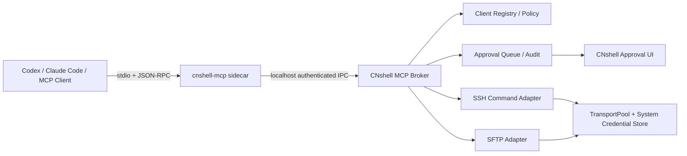

# CNshell MCP 开发规划

> 文档状态：v0.5，P0/P1/P1.5 与 P2 首版功能已实现；macOS/腾讯云补充验收及跨平台真机验收进行中
>
> 制定日期：2026-07-21
>
> 参考项目：[CrazyFigure/MyTerminal](https://github.com/CrazyFigure/MyTerminal) 0.4.6（MIT）
>
> 目标平台：macOS 13+、Windows 10 22H2+，与 CNshell 主程序同版本发布

## 一、结论与当前基线

MCP（Model Context Protocol）已经落地为 CNshell 的一项 P0 能力。它可以让 Codex、Claude Code、
opencode 及其他 MCP 客户端，在不复制连接资料、不读取明文凭据的前提下，使用 CNshell 已保存的
SSH 连接执行受控命令、读取远端文件，并在 CNshell 界面完成写操作审批。

规划制定时 CNshell 没有 MCP Server、MCP stdio sidecar、本地 Broker、MCP 客户端登记或 MCP 审批队列。
但以下底层能力已经存在，不应重新实现：

- `src-tauri/src/ssh.rs` 已提供主机指纹校验、代理与跳板机、凭据加载、连接诊断、命令执行、
  `TransportPool` 和断线错误分类。
- `src-tauri/src/sftp.rs` 已提供目录列表、文本读取与原子保存、新建、重命名、删除、上传和下载。
- 密码与秘密已存入 macOS Keychain 或 Windows 凭据管理器，不进入 SQLite、前端或诊断日志。
- `src-tauri/src/plugin.rs` 已有签名、细粒度权限、一次性确认、凭据代理和有界审计，可复用其
  “外部调用者不接触凭据”的安全模型，但 MCP 客户端不等同于 CNshell WASM 插件。
- 监控、任务、命令历史、AI 隐私预览和团队审计可以作为后续 MCP Resources/Tools 的数据来源。

MyTerminal 的 MCP Bridge 架构和工具范围可以参考，但不直接复制它的 SSH/SFTP 实现、手写 HTTP
解析器或宽泛自动执行策略。CNshell 的实现必须复用现有后端，并补齐消息上限、客户端身份、
本地文件授权、速率限制、取消和脱敏审计。

## 二、产品目标与非目标

### 2.1 产品目标

1. 用户可以在 CNshell 中一键启用或关闭 MCP，并看到 Broker、客户端和请求状态。
2. MCP 客户端只引用 CNshell 连接 ID，不获得密码、私钥、代理秘密或可复用认证材料。
3. 只读操作可以在明确授权范围内自动执行；命令、远端写入和本地文件访问默认逐次确认。
4. 所有请求都绑定客户端、连接、工具和短期会话，并支持超时、取消、限流和撤销。
5. macOS 与 Windows 使用同一套工具语义、数据库 schema 和前端审批界面。
6. MCP 关闭、CNshell 退出或客户端授权撤销后，已有 capability 和待审批请求立即失效。
7. 默认审计只记录元数据，不保存命令输出、文件正文、终端内容或凭据。

### 2.2 首版非目标

- 不把 CNshell 变成可从局域网或互联网访问的 MCP 服务。
- 不允许 MCP 客户端读取 Keychain、Windows 凭据管理器、私钥文件或同步密钥。
- 不提供无确认的全局“允许所有命令/所有文件”开关。
- 不接管交互式全屏程序、持续 PTY、`sudo` 密码输入、Mosh、RDP、Serial 或团队多人终端。
- 不允许 MCP 客户端传入任意本地路径后直接读取或写入；本地路径必须由原生选择器授权。
- 不在首版实现远程 MCP、云端中继、账号同步授权或第三方插件自定义 MCP 工具。
- 不把“客户端发来请求”视为用户已经批准操作。

## 三、总体架构



### 3.1 `cnshell-mcp` stdio sidecar

- 作为应用资源随 macOS universal、Windows x64 和 Windows ARM64 安装包分发。
- 由 Codex、Claude Code 等 MCP Host 启动，标准输入/输出只传 MCP JSON-RPC 帧。
- 日志只写标准错误，并做秘密和连接资料脱敏；标准输出禁止出现调试文本。
- 负责 MCP 初始化、能力协商、`tools/list`、`tools/call`、`ping`、取消和结构化错误映射。
- 优先使用审计过并固定版本的官方 Rust MCP SDK；不得再实现一套无边界的手写 framing/parser。
- 找不到运行中的 CNshell、MCP 未启用或授权失效时，返回可操作错误，不自行启动隐藏的主程序。

### 3.2 CNshell 本地 Broker

- 首版仅绑定 `127.0.0.1` 随机端口；禁止 `0.0.0.0`、局域网地址、端口转发和远程监听。
- 每次 CNshell 启动生成新的 Broker generation 与随机认证秘密，旧 generation 立即失效。
- 客户端长期 secret 由受管 sidecar 放入系统凭据库，SQLite 只保存 SHA-256；每次启动轮换的
  Broker token 放入当前用户私有的临时 discovery，不进入客户端配置、数据库、日志或响应。
- discovery 文件在 macOS 使用 `0600`，Windows 使用仅当前用户可读写的 ACL；拒绝符号链接，
  应用退出或关闭 MCP 后删除，复制旧文件也会因 generation 与监听生命周期失效。
- sidecar 与 Broker 使用单请求 loopback TCP：4 字节网络序长度前缀后跟严格 JSON；它不是 HTTP，
  不接受 `Host`、`Origin`、`Content-Type`、批次或浏览器请求语义。
- 校验当前 generation、Broker token、客户端凭据、sidecar 规范化路径与 SHA-256、协议版本和请求 ID；
  单消息最多 1 MiB，连接、读取与等待均有超时，客户端断开会触发请求取消。
- Broker 不把认证 token、系统凭据或完整错误堆栈返回前端。

后续可评估 macOS Unix Domain Socket 与 Windows Named Pipe；首版先以统一、可测试的 loopback
传输交付，但安全测试必须覆盖同机非授权进程、旧 token、伪造 discovery 和端口复用。

### 3.3 MCP 业务适配层

新增适配层只把已校验的 MCP 参数转换为现有 Rust 服务调用：

- SSH 命令调用现有 `execute_profile_command` 和 `TransportPool`。
- SFTP 调用现有 `list`、`open_text`、`save_text`、`create_text`、`mkdir`、`rename`、`delete`
  与传输队列；不建立第二套 SSH 会话管理。
- 主机监控只返回 CNshell 已采集或按白名单采集的数据，不执行客户端提供的探测脚本。
- 所有适配函数接收后端生成的 `ClientContext`、`GrantContext` 和 `RequestContext`，不能只凭
  前端传来的布尔值绕过授权。

## 四、MCP 工具设计

工具名称使用 `cnshell_` 前缀，避免 MCP Host 把多个 Server 工具合并后发生重名。所有 tool
input 使用严格 JSON Schema，拒绝未知字段、空 ID、路径中的 NUL、超长字符串和不支持的协议。

### 4.1 P0：只读工具

| 工具 | 主要输入 | 返回 | 默认策略 |
| --- | --- | --- | --- |
| `cnshell_list_connections` | `cursor`、`limit`、可选 `tag` | 连接 ID、名称、协议、标签和在线状态 | 客户端登记时确认一次 |
| `cnshell_open_session` | `connectionId` | 短期 `sessionId`、能力和过期时间 | 每个新连接首次确认 |
| `cnshell_close_session` | `sessionId` | 关闭结果 | 自动 |
| `cnshell_file_list` | `sessionId`、远端 `path`、`cursor`、`limit` | 有界目录项与下一页游标 | 已授权远端根内自动 |
| `cnshell_file_read` | `sessionId`、`path`、`offset`、`maxBytes` | UTF-8 文本、SHA-256、截断信息 | 已授权远端根内自动 |
| `cnshell_system_info` | `sessionId`、字段列表 | OS、CPU、内存、磁盘、负载和采集时间 | 自动，不接受任意命令 |

P0 约束：

- `list_connections` 默认不返回 host、username、notes、启动命令、环境变量、代理和路径。
  用户可为单个已登记客户端额外开启“显示主机地址和用户名”，notes 永不暴露。
- 首版只允许打开 `ssh` 连接；Telnet、Serial、RDP、Mosh 和 Local Shell 明确返回 unsupported。
- `sessionId` 为不可预测的短期能力标识，绑定客户端和 connection；空闲 15 分钟、最长 8 小时。
- `file_list` 每页最多 500 项，序列化结果不超过 512 KiB，不递归遍历目录。
- `file_read` 首版只读普通文本文件，单次最多 256 KiB；二进制、设备、FIFO、socket 和符号链接
  默认拒绝。大文本通过 offset 分页，返回实际字节区间和 SHA-256。
- 所有工具结果包含 `requestId`，但不包含内部数据库路径、凭据引用或 Rust 调试信息。

### 4.2 P1：需审批的命令与远端写操作

| 工具 | 主要输入 | 关键约束 | 默认策略 |
| --- | --- | --- | --- |
| `cnshell_run_command` | `sessionId`、`command`、`timeoutSeconds` | 非交互式、输出有界、可取消 | 每次审批 |
| `cnshell_file_write` | `sessionId`、`path`、UTF-8 `content`、`expectedSha256` | 原子保存、并发冲突检测 | 每次审批 |
| `cnshell_file_mkdir` | `sessionId`、`path` | 禁止根目录和隐式递归越界 | 每次审批 |
| `cnshell_file_rename` | `sessionId`、`from`、`to`、`expectedSha256` | 同一授权范围内移动 | 每次审批 |
| `cnshell_file_delete` | `sessionId`、`path`、`recursive` | 根路径永不允许，递归单独高危确认 | 每次审批且不可持久放行递归删除 |

命令执行约束：

- 命令最多 16 KiB，默认超时 30 秒，最大 10 分钟，stdout/stderr 合计最多 1 MiB。
- 首版是一条非交互式远端命令，不复用用户可见终端 PTY，不接受密码、键盘或控制序列回传。
- 审批界面显示完整命令、目标连接、工作目录、超时、客户端名称和风险命中项。
- `sudo`、`su`、包管理、账号权限、磁盘操作、关机重启、网络规则、下载后执行、管道到 shell、
  通配递归删除等标记为高风险；风险识别只负责升级提示，不能作为唯一安全边界。
- 命令返回退出码、耗时、截断状态和有界输出；输出默认不进入 MCP 审计记录。

远端写入约束：

- `file_write` 单次正文最多 256 KiB，使用临时文件、`fsync` 和原子重命名；覆盖前验证
  `expectedSha256`，不匹配时返回 conflict，不能静默覆盖用户的新版本。
- 文件路径必须位于授权远端根内；规范化后重新校验，拒绝 `..` 越界和符号链接逃逸。
- 删除目录默认 `recursive=false`；`/`、用户配置的连接根和授权根本身永不允许删除。
- 审批预览文本差异、目标文件元数据、是否覆盖、递归范围和估算条目数；超出预览上限则明确显示。

### 4.3 P1.5：受控上传与下载

| 工具 | 主要输入 | 本地授权要求 | 默认策略 |
| --- | --- | --- | --- |
| `cnshell_file_upload` | `sessionId`、`localGrantId`、`relativePath`、`remotePath` | 用户预先选择只读本地文件或目录 | 每次审批 |
| `cnshell_file_download` | `sessionId`、`remotePath`、`localGrantId`、`relativePath` | 用户预先选择可写目标目录 | 每次审批 |

- MCP 客户端不能直接传 `/Users/...`、`C:\\...` 等绝对本地路径读取任意文件。
- macOS 使用 security-scoped Bookmark，Windows 使用原生选择器与经校验的当前用户路径记录。
- `localGrantId` 绑定客户端、授权方向和精确根目录；默认一次性，持久授权必须在设置中单独创建。
- 路径规范化后必须仍位于授权根，拒绝符号链接、junction、reparse point 和父目录越界。
- 下载沿用 `.part`、冲突策略、取消清理和成功后原子改名；上传沿用现有传输队列和进度事件。
- 首版不把本地文件正文经 Broker/MCP JSON 传输，sidecar 只传 capability，文件由 CNshell 后端读取。

### 4.4 P2：Resources、Prompts 与精确规则

P2 首版已经交付 4 个只读 Resources：

| Resource | 类型 | 数据边界 |
| --- | --- | --- |
| `cnshell://guide/mcp` | 静态 | 仅返回内置 MCP 使用说明 |
| `cnshell://guide/security` | 静态 | 仅返回内置安全边界说明 |
| `cnshell://connections` | 动态 | 只返回当前客户端被明确授予 `cnshell_list_connections` 权限的连接；主机和用户名受独立隐私开关控制，不返回备注、凭据或其他连接秘密，最多 256 条 |
| `cnshell://audit/recent` | 动态 | 只返回当前客户端最近 100 条脱敏审计元数据；不返回 request ID、目标摘要、命令、文件路径、正文或输出 |

两个动态 Resources 通过 Broker 校验当前 generation、Broker token、客户端 secret、受管 sidecar
身份、客户端状态、授权、限流和审计。其 Broker 内部操作名为 `resource:connections` 与
`resource:audit-recent`，不会加入 `tools/list`，也不能通过 `tools/call` 伪装成工具调用。

P2 首版同时交付：

- Prompts：`cnshell_diagnose_connection` 和 `cnshell_review_command`，只生成受控诊断/安全评审模板，
  不直接执行工具。
- 精确命令规则：只保存完整命令文本的 SHA-256 摘要，不保存或显示历史命令明文；仅固定只读命令
  和不含格式化/展开的单字面量 `printf` 可保存。保存时 Broker 会再次校验完整命令与摘要一致；升级会撤销
  早期预览版规则，避免旧策略遗留自动批准。设置页可查看连接、工具、摘要、创建时间和最近使用时间，并可逐条确认撤销。
- 每个客户端最多保存 256 条精确规则；达到上限后必须先撤销旧规则，不能静默覆盖。
- 规则撤销立即生效并写入脱敏审计；下一次相同命令重新进入审批流程。

以下属于未来可选扩展，不作为 MCP 首版完成的阻塞项：

- 监控快照、任务结果和命令历史摘要等更多动态 Resources。
- 发布检查、日志分析等 Prompts；所有动态上下文仍须经过 Broker 授权与脱敏。
- 受限自动化计划运行、任务状态查询、隧道状态查询和 AI 错误解释 Tools。
- 插件动态注册 MCP 能力。只有签名插件、稳定工具 schema 和独立权限审计成熟后才评估开放；
  插件不能直接注册原生 handler 或绕过 Broker。

## 五、客户端登记、授权与审批

### 5.1 客户端登记

首次连接时 CNshell 展示：客户端名称、可验证的可执行文件路径/签名信息、MCP 配置来源、申请的
能力和首次时间。客户端自己声明的名称只作为提示，不作为可信身份。

登记记录至少包含：

- `clientId`：CNshell 生成的稳定 ID。
- 可执行文件摘要、规范化路径和可获得的平台签名信息。
- 创建、最近使用、撤销时间和授权版本。
- 允许发现的连接范围、允许的工具、远端路径根和本地 grant 引用。
- 并发、速率、会话 TTL 与是否允许显示 host/username。

客户端二进制摘要、签名或申请能力变化后，原授权进入“需要重新确认”，不能静默继承。

### 5.2 权限模型

授权键固定为以下组合，不提供隐式通配的超级权限：

```text
client × connection × tool × remote-root × local-grant × rule × expiry
```

- 初始版本只持久授权 P0 只读工具；P1 默认单次 capability。
- 用户后续可以为具体客户端、具体连接和具体目录持久放行低风险写入。
- `run_command` 持久规则只允许固定低风险白名单命令和不含格式化/展开的单字面量 `printf`；规则键是完整命令文本的 SHA-256，不能使用字符串前缀、通配符或参数模板匹配。
- 递归删除、授权根删除、凭据访问和本地授权范围扩展不能设置为永久自动批准。
- 撤销客户端时关闭它的 MCP sessions、取消待审批和进行中请求，并清理对应本地 grant。

### 5.3 审批队列

审批项包含：客户端、连接、工具、完整命令或规范化路径、风险、差异/内容摘要、创建时间和倒计时。

- 默认 120 秒未处理即拒绝；客户端断开、CNshell 退出或授权版本变化时立即拒绝。
- 同一客户端最多 10 个待审批、2 个执行中请求；全局最多 50 个待审批。
- 支持“允许一次”“拒绝”“允许本会话”和满足安全条件时的“保存精确规则”。
- “允许本会话”仅持续到该客户端进程或 CNshell generation 结束。
- 精确命令规则只保存 SHA-256 摘要，每客户端最多 256 条；用户可在设置页查看摘要并逐条撤销。
- 审批结果由 Rust 后端签发一次性 capability；前端不能直接调用执行函数模拟批准。
- 高风险确认不得被通知弹窗中的单击直接批准，必须回到 CNshell 显示完整详情。

## 六、隐私、安全与审计边界

### 6.1 必须成立的安全不变量

1. MCP 响应、日志、数据库和前端状态永不包含密码、私钥、口令、Broker token 或系统凭据引用。
2. Broker 只接受当前 generation、当前客户端授权和未使用 capability；全部使用恒定时间 token 比较。
3. 所有 ID、路径、分页游标、输出大小和超时由后端再次验证，不信任 sidecar 或前端。
4. MCP 关闭后不保留监听端口；应用退出时终止受管请求并清除临时 discovery/capability。
5. 远端读取和写入均验证普通文件类型、路径边界和符号链接策略。
6. 本地文件只能通过用户授权的精确文件或目录 grant 访问。
7. 协议错误、认证失败和拒绝操作使用稳定错误码，不返回内部堆栈、SQL、绝对应用数据路径。

### 6.2 审计内容

默认记录：

- request ID、client ID、tool、connection ID、规范化目标摘要、风险等级和时间。
- 审批结果、规则 ID、开始/结束、退出类别、耗时、传输字节数和是否截断。
- 客户端登记、权限变化、撤销、Broker 启停和认证失败计数。

默认不记录：

- 命令 stdout/stderr、文件正文、目录完整清单、终端滚动内容。
- 密码、私钥、token、环境变量值、AI Provider key 或同步口令。
- 用户 notes、启动命令、未授权 host/username 和本地绝对路径。

审计最多保留 4,096 条或用户配置的保留天数，导出时再次脱敏，通过同目录临时文件原子替换，
拒绝符号链接目标。用户可以清空审计，但清空动作本身先记录一条元数据事件。

### 6.3 限流、资源与生命周期

- 默认每客户端每分钟 60 个只读调用、10 个写调用；认证失败采用指数退避。
- 每客户端最多 4 个 MCP session、2 个 SSH/SFTP 执行任务；复用现有 TransportPool。
- 所有请求支持取消；命令取消必须关闭对应 channel，文件取消沿用 `.part` 清理语义。
- 请求完成后清零包含敏感预览的临时缓冲；审批正文不写浏览器持久存储。
- CNshell 睡眠唤醒、网络切换和 transport 重连不自动重新执行非幂等写请求。

## 七、界面与用户流程

在“设置”增加“MCP 与外部工具”页面：

- MCP 总开关、Broker 状态、当前版本、配置目录和“复制客户端配置”入口。
- 已登记客户端列表：在线状态、最后使用、可执行文件身份、连接数、工具数、撤销和重新授权。
- 授权详情：连接、工具、远端根、本地 grant、规则、有效期和立即撤销。
- 审计列表与脱敏导出。

在主工作区增加统一审批抽屉：

- 显示待审批数量，默认不遮挡终端输入和文件操作。
- 命令使用等宽文本完整展示；文件写入展示有界 diff；删除展示目标和递归范围。
- 提供批准、拒绝和展开详情；请求完成后显示结果，但普通成功提示 5 秒自动消失。
- 窗口关闭时若 Broker、隧道或任务仍在运行，沿用统一后台运行决策；系统托盘作为独立阶段实现，
  不让 MCP 功能偷偷改变当前退出语义。

配置生成首批支持：

- Codex CLI / Codex desktop 可识别的 stdio MCP 配置。
- Claude Code / Claude Desktop 可识别的 stdio MCP 配置。
- 通用 JSON 配置片段与 sidecar 自检命令。

生成配置时只写 sidecar 的绝对路径和非秘密参数，不把 Broker token 写入 MCP 客户端配置。

## 八、代码与数据落点建议

最终文件名可在实施时按现有模块边界微调，建议结构如下：

```text
src-tauri/src/mcp.rs                    # Broker 生命周期、状态和 Tauri commands
src-tauri/src/mcp_protocol.rs           # Broker 请求/响应、严格 schema 和错误码
src-tauri/src/mcp_policy.rs             # 客户端、grant、规则和 capability 校验
src-tauri/src/mcp_approval.rs           # 审批队列、超时、取消和审计
src-tauri/src/mcp_tools.rs              # SSH/SFTP/monitor 适配层
src-tauri/src/bin/cnshell-mcp.rs        # stdio MCP sidecar
src/features/mcp/*                      # 设置、客户端、授权、审批与审计 UI
src/lib/mcp.ts                          # typed IPC facade
tests/mcp/*                             # 前端流程与状态回归
```

数据库新增 migration，表名建议：

| 表 | 内容 | 明确禁止保存 |
| --- | --- | --- |
| `mcp_clients` | 客户端身份、摘要、状态和时间 | token、命令、文件内容 |
| `mcp_grants` | client/connection/tool/path/rule/expiry | 系统凭据、本地文件内容 |
| `mcp_audit_events` | 有界元数据审计 | stdout/stderr、正文、秘密 |

待审批和短期 capability 只保存在内存，不写 SQLite。Broker generation token 只写入当前用户私有
discovery，并在每次启动轮换；应用退出或关闭 MCP 后删除。客户端长期 secret 由 sidecar 写入系统
凭据库，SQLite 只保存 SHA-256。migration 必须保持现有正式 updater 的向后读取规则。

## 九、分阶段实施计划

### 当前进度（2026-07-23）

| 阶段 | 状态 | 已有证据 | 剩余验收 |
| --- | --- | --- | --- |
| 0 协议与安全验证 | 已完成，macOS 与 Windows x64 验证通过 | 固定 `rmcp 2.2.0`；stdio/Broker 1 MiB 上限、严格 schema、重复 request ID 拒绝、断开/撤销/关闭取消、loopback、generation/token、macOS `0600`、Windows Owner-only ACL；Windows x64 测试以系统 API 读取实际 DACL 并确认 SDDL 为 `D:P(A;;FA;;;OW)`，同时验证 junction/reparse 组件拒绝。客户端 secret 由 sidecar 自有凭据项保存；Windows 实装 sidecar 已验证 provision/revoke 后不残留凭据，且静态 CRT 副本不依赖 VC runtime。隔离 App `Command+Q` 后 discovery 与进程无残留 | Windows ARM64 原生运行；正式签名与公证 |
| 1 P0 只读 | 已完成，隔离客户端腾讯云复验通过 | Codex CLI 与官方 MCP Inspector CLI 均完成连接清单、短期会话、系统信息、目录分页和关闭；腾讯云 SSH/SFTP 真实读操作通过；客户端/连接/工具/远端根授权和设置 UI 已完成；本轮隔离 sidecar 已真实完成初始化、连接清单、动态 Resources、短期会话审批、系统信息、3 项目录分页、35 字节文本读取和关闭。远端 symlink、`..` 越界均被拒绝，未授予写工具时文件写入也被拒绝；目录扫描先以 10 万项/8 MiB 路径预算限界，再将 MCP 响应缩至 512 KiB 并保持正确游标 | 其他 Host 互操作可作为扩展覆盖 |
| 2 P1 写入与审批 | 已完成，腾讯云真实验收通过 | 真实 MCP 客户端已完成命令、原子文本写入、错误 SHA-256 冲突、mkdir、rename 和删除；120 秒内存审批、风险预览、请求取消、每客户端 2 并发、输出总上限与审批 UI 已完成；真实客户端超时会撤销待审批请求 | Windows 原生 UI 审批和断网恢复属于后续桌面体验覆盖 |
| 3 P1.5 上传下载 | 已完成，macOS 真实验收与 Windows x64 安全/包验证通过 | 原生选择器已创建精确文件/目录授权；真实 MCP Host 完成 82 字节上传和 35 字节下载，SHA-256 与远端 fixture 一致，一次性授权随后失效且无 `.part` 残留；相对路径、symlink/reparse 拒绝、目录预检和原子替换已有自动化。Windows x64 CI 已验证 junction 拒绝及 MCP sidecar/NSIS 安装生命周期 | Windows 原生文件选择器的人工端到端走查，以及 Windows ARM64 真机 |
| 4 P2 首版 | 已完成，动态 Resource 与规则真实 stdio 验收通过 | stdio 已提供 4 个 Resources（2 个静态、2 个经 Broker 授权过滤的动态资源）与 2 个安全 Prompts；隔离客户端真实返回 4/13/2 项目录，连接 Resource 仅显示一条授权连接且隐藏主机/用户名，审计 Resource 无命令/路径泄露，`resource:*` 内部操作不能经 `tools/call` 调用；精确命令规则支持摘要查看、最近使用时间、单条撤销和每客户端 256 条上限。保存、自动匹配、撤销后重新审批均已真实验证；规则资格现收紧为保守低风险白名单 | 其他 Host 与 Windows 原生 UI 属扩展覆盖 |
| 发布与文档 | MCP 首版功能门禁完成 | macOS universal 与 Windows x64/ARM64 构建入口、安装资源检查、完整 Apache-2.0 与用户/安全/隐私/排障文档已接入。GitHub CI run `29941059465` 已通过 Windows x64 测试、严格 Clippy 和 ARM64 编译；Windows Packaging run `29941061193` 的 x64 job 已通过 MCP sidecar、NSIS、PE 校验、安装、覆盖升级、卸载和重装 | Developer ID、公证、Authenticode、Windows ARM64 真机和正式更新服务仍属发行环境 |

MCP 首版功能验收现已完成。Codex CLI 与官方 MCP Inspector CLI 的真实互操作、腾讯云 SSH/SFTP 读写、macOS 原生授权与真实上传下载、Windows x64 DACL/junction 安全测试和 Windows 安装包生命周期均有证据。当前配置生成会显式绑定受管 sidecar 的规范化路径与 SHA-256，未知可执行文件不能通过首次请求自行认领身份；客户端撤销先使数据库与运行时授权失效，再由已验证 sidecar 自验摘要并清理自身凭据，清理失败不会恢复授权。隔离客户端已完成动态 Resources 授权过滤、审计隔离、精确规则保存/撤销后重新审批，以及退出后的 discovery/Broker/sidecar 清理验收。Windows 原生文件选择器人工走查、Windows ARM64 真机、父 MCP Host 平台签名身份强化和正式发行凭据仍保持明确的后续边界。

| 阶段 | 交付内容 | 前置条件 | 完成定义 |
| --- | --- | --- | --- |
| 0 | 协议与安全技术验证 | 选定 Rust MCP SDK | stdio 握手、Broker 鉴权、限长与错误模型测试通过 |
| 1 | P0 只读 MCP | 客户端登记与连接授权 | 六个 P0 工具可用，Codex/Claude 至少各一条真实调用证据 |
| 2 | P1 审批与远端写入 | 后端 capability 和审批 UI | 命令、写入、mkdir/rename/delete 有界执行并完成异常测试 |
| 3 | P1.5 上传下载 | 本地 grant 与跨平台路径安全 | macOS/Windows 授权、取消、冲突和原子保存通过 |
| 4 | P2 精细规则与扩展 | P0/P1 稳定性数据 | 规则、审计、Resources/Prompts 按评审结果交付 |

### 阶段 0：协议与安全技术验证

- 固定 MCP SDK、协议版本策略和 JSON Schema 生成方式。
- 建立 stdio sidecar，完成 `initialize`、`tools/list`、`tools/call`、`ping` 和 cancellation。
- 建立 loopback Broker、generation、sidecar 自持客户端凭据和 discovery 权限。
- 验证 sidecar 标准输出纯净、消息上限、半包/粘包、无效 JSON、重复 ID、超时和取消。
- 增加假的 SSH/SFTP adapter，阶段 0 不读取真实连接和凭据。

阶段 0 通过后才能接入真实 CNshell 数据。

### 阶段 1：P0 只读 MCP

- 完成客户端登记、连接选择、隐私级别、短期 session 和撤销。
- 接入连接清单、SFTP 列表/文本读取和监控快照。
- 提供 Codex、Claude 和通用客户端配置生成、自检和故障诊断。
- 增加 MCP 设置页、在线状态、只读审计与关闭清理。

### 阶段 2：P1 审批与远端写入

- 完成内存审批队列、风险预览、一次性后端 capability 和逐次审批。
- 接入非交互命令、原子文本写入、新建目录、重命名和删除。
- 完成超时、取消、断线、重连、并发冲突、输出截断和重复请求幂等边界。
- 首批持久规则只支持精确连接、精确工具和精确远端根；命令规则进入下一阶段。

### 阶段 3：P1.5 上传下载

- 建立本地文件/目录 grant，处理 macOS Bookmark 与 Windows 路径/reparse point。
- 复用现有传输队列、任务进度、冲突策略、取消和 `.part` 清理。
- 验证 MCP 客户端无法通过绝对路径、父目录、符号链接或硬链接越权。

### 阶段 4：P2 精细规则与扩展

- 已增加脱敏审计 JSON 原子导出、2 个静态 Resources、2 个经 Broker 授权的动态 Resources 和
  2 个安全 Prompts。
- 已完成精确命令 SHA-256 规则、设置页查看/单条撤销、最近使用时间和每客户端 256 条上限。
- 根据实际使用反馈决定监控/任务等更多动态 Resources、自动化、隧道状态与插件扩展优先级；
  这些可选扩展不阻塞 MCP 首版完成。
- 评估系统托盘，让 Broker 在用户明确选择后台运行时保持可见、可退出。

## 十、测试与验收矩阵

### 10.1 自动化测试

| 范围 | 必测场景 |
| --- | --- |
| MCP 协议 | 初始化顺序、协议不兼容、通知、取消、重复 ID、批次上限、错误结构 |
| stdio | 半帧、连续帧、超大帧、stdout 污染、stderr 脱敏、父进程退出 |
| Broker | 非 loopback、无 token、旧 token、伪造 discovery、错误长度前缀、超时、端口复用、并发上限 |
| 客户端身份 | 首次登记、摘要变化、路径变化、签名变化、撤销和旧授权拒绝 |
| Policy | 跨客户端、跨连接、跨工具、路径越界、过期、重复 capability、前端伪造批准 |
| SSH | 连接池复用、认证失败、主机密钥变化、跳板/代理、断线、取消和输出截断 |
| SFTP | 文本分页、二进制拒绝、符号链接、原子写冲突、根删除、递归删除和路径规范化 |
| 本地文件 | macOS Bookmark、Windows ACL/reparse point、撤销、上传只读、下载原子保存 |
| UI | 待审批数量、详情、超时、拒绝、重复点击、窗口切换、浅色/深色与键盘操作 |
| 隐私 | DB、日志、诊断、审计、MCP 响应中扫描密码、token、私钥和文件正文 |

### 10.2 真实互操作验收

- Codex 通过 MCP 列出授权连接、读取远端目录和文件，并正确处理未授权连接。
- Claude Code 或 Claude Desktop 完成同一套 P0 工具调用，确认不是只兼容单一 Host。
- 使用腾讯云 SSH 测试机完成只读、命令审批、文件冲突、取消和网络断开恢复。
- macOS Apple Silicon 与 Windows x64 安装包内 sidecar 均可启动、关闭且不会残留后台进程。
- Windows ARM64 在取得真机前只声明构建/PE 证据，不声明运行通过。
- MCP 被关闭、客户端被撤销和 CNshell 退出后三种场景均无法继续调用旧 session。

### 10.3 安全验收

- 同机未登记进程读取 discovery 后仍不能调用 Broker。
- 修改客户端二进制后旧授权失效，不能仅伪造客户端名称继续使用。
- MCP 客户端无法读取密码、私钥、Keychain、Credential Manager 或任意本地绝对路径。
- 1 MiB+ 请求、路径炸弹、超大目录、并发洪泛和长时间命令均被有界处理。
- `file_write` 冲突不覆盖，下载失败不留下完整目标文件，取消不自动重放非幂等操作。
- 审计导出不包含命令输出、文件正文、凭据、Broker token 或未授权连接资料。

## 十一、发布、文档与许可证

- `cnshell-mcp` 与主程序同仓库、同版本、同 CI 构建，并纳入 macOS universal 与 Windows
  x64/ARM64 架构检查、签名、公证/Authenticode 和安装卸载生命周期。
- 锁定 MCP SDK 版本与依赖哈希，运行许可证和供应链审计；新增许可证写入第三方声明。
- 用户指南增加启用、客户端配置、权限、审批、撤销、审计和故障排查。
- 安全说明增加本地 Broker、discovery、system credential、local grant 和威胁模型。
- 发布说明明确 MCP 默认关闭、只监听本机、哪些操作需要确认以及当前支持的 MCP Host。
- 参考 MyTerminal 的产品思路时保留本文件中的来源说明；实现代码优先独立编写并复用 CNshell
  现有模块，若实际复制 MIT 代码片段则按许可证保留原版权声明。

## 十二、阶段完成定义

MCP 只有同时满足以下条件才可标记“功能完成”：

1. P0/P1 对应工具真实调用成功，而不是只有依赖检测、配置页面或 mock。
2. Codex 与至少另一种 MCP Host 完成互操作，协议错误和取消路径也有证据。
3. 权限、审批、token、路径、消息大小、并发和审计边界均有自动化测试。
4. macOS 与 Windows 安装包包含正确架构 sidecar，主程序退出后无遗留 Broker 或 helper。
5. 用户文档、安全说明、隐私说明和第三方许可证同步更新。
6. 没有对应真机或发行凭据的项目继续标记“真机待验”或“发行待配置”，不以编译代替验收。

## 十三、下一步执行顺序

1. 已完成：启动隔离测试 App、创建隔离 MCP 客户端，验证 `resources/list` 返回 4 项；确认
   `cnshell://connections` 只服从连接清单工具授权，`cnshell://audit/recent` 只返回当前客户端脱敏元数据。
2. 已完成：隔离客户端在真实 CNshell 审批中保存一条精确命令规则；设置页只显示 SHA-256 摘要，同一命令的后续真实调用未出现命令审批卡且正常完成。规则撤销后相同命令重新出现审批，并在单次批准后正常完成。
3. 已完成：人工批准 macOS 上传和下载，上传源文件与下载结果 SHA-256 一致，成功后一次性授权失效，下载目录无 `.part` 残留。
4. 已完成：使用腾讯云 SSH 测试机完成原子写、错误 SHA-256 冲突、mkdir、rename、删除和传输；验收临时远端文件/目录已清理。客户端超时取消和失败清理由自动化证据覆盖，不重复长时等待。
5. 已完成：重建 universal 隔离 App，验证包内 MCP sidecar 为 arm64 + x86_64、ad-hoc 签名有效，并重新绑定客户端；真实 Host 确认 Tool 结果标准 `content` 与 `structuredContent` 均存在。
6. 已完成：隔离客户端与其 Keychain secret 已撤销删除；测试 App 退出后 discovery、Broker 与 sidecar 无残留。旧的 `Codex MCP Acceptance` 客户端未被触碰。
7. 已完成：GitHub CI run `29941059465` 通过 Windows x64 测试、严格 Clippy 和 ARM64 编译；Windows Packaging run `29941061193` 的 x64 job 通过当前 MCP sidecar、NSIS、PE 校验、安装、升级、卸载和重装。
8. 已完成：Windows x64 的 discovery DACL 由系统 API 实测为受保护 Owner Rights SDDL `D:P(A;;FA;;;OW)`，junction/reparse 组件拒绝由 Windows 专属测试覆盖；已安装 sidecar 的 Credential Manager provision/revoke 与静态 CRT 副本检查通过。Windows 原生文件选择器的人工走查未声明完成。
9. 已完成：MCP 首版功能验收完成。Windows ARM64 真机、父 MCP Host 平台身份强化、更多动态 Resources、自动化、隧道状态、插件动态注册与正式发行签名继续作为可选后续增强或发行环境工作。

## 十四、MyTerminal 功能接入评估

本节基于 MyTerminal 0.4.6 的源码、中文功能说明和 MCP Bridge 实现整理。它用于决定哪些
能力值得进入 CNshell，不能作为“已经完成”的证明；完成状态以本项目代码、自动化测试和真实
跨平台验收为准。

| MyTerminal 能力 | CNshell 当前基线 | 接入决定 | 优先级与理由 |
| --- | --- | --- | --- |
| `CLI + MCP + GUI Broker` | 已有 `cnshell-mcp` stdio sidecar、loopback Broker、客户端登记、审批和审计实现 | 保留并作为主路线；继续做真实 Host 互操作和安装包验收 | P0。它是最有价值的差异化能力，但必须保持默认关闭和本机监听 |
| MCP 工具链（连接、会话、命令、读写、上传下载、删除、重命名、mkdir） | P0/P1/P1.5 工具已实现，前端设置与授权页已接入 | 复用现有 SSH/SFTP/传输队列，不复制 MyTerminal 的协议实现 | P0。先完成腾讯云、Codex、第二 MCP Host 的真实证据 |
| 同一 AI 会话命令串行、不同会话并行 | MCP 后端已有按会话的并发限制与取消模型 | 明确写入验收：连续 `cd`/写入命令不能乱序，不同连接可并行 | P0。避免远程工作目录和非幂等操作产生竞态 |
| AI 请求侧栏、完整审批预览、桌面通知 | CNshell 已有统一审批状态和设置入口；通知和主工作区抽屉仍需按现有 UI 统一 | 将审批抽屉、倒计时、风险标记和 5 秒成功提示作为首版体验；桌面通知单列实现 | P1。通知只能聚焦审批，不能绕过高风险确认 |
| 连接白名单/自动执行 | CNshell 采用客户端 × 连接 × 工具 × 路径的 capability 授权，默认逐次确认 | 不提供 MyTerminal 式全局“全部自动执行”；只增加精确、可撤销、带有效期的规则 | P1。避免一个开关放大到所有主机和写操作 |
| 本地 AI CLI 启动器（Claude、Codex、opencode、自定义命令） | CNshell 已有本地 Shell/命令预设基础 | 增加工作目录历史和命令预设的易用性；不把本地 CLI 进程伪装成远端 MCP 能力 | P1。提升本地开发入口，但与 SSH 安全边界分开 |
| 终端输出缓存、后台会话限额、关闭会话回收 | CNshell 已有前后端有界输出队列和 LRU 缓存 | 保持硬上限、截断提示和显式回收，并补充 MCP/终端共享资源的压力测试 | P1。解决长日志和多标签导致的内存增长 |
| 辅助 SSH/SFTP 会话复用、失效后重试 | CNshell 已有 `TransportPool`/辅助会话缓存与断线分类 | 继续复用；针对 MCP 请求增加“只重试一次、写操作不自动重放”验收 | P1。降低频繁握手，同时避免重复非幂等操作 |
| SFTP 批量传输、递归目录、冲突命名、`.part` 原子落盘 | CNshell 已有传输队列、进度、冲突和原子文件语义 | 作为 MCP 上传下载的实现来源，补充目录大规模、取消和符号链接测试 | P1。真实文件传输比把正文编码进 JSON 更可靠 |
| 终端 cwd 与文件面板联动、历史目录 | CNshell 已有 cwd 同步和文件树状态保持逻辑 | 继续修复回到初始目录等回归；将路径联动作为普通终端体验，不暴露给 MCP 客户端 | P1。减少用户在终端与文件面板间重复定位 |
| 远端运行状态、磁盘/网络监控 | CNshell 已有运行状态采集和不可用降级文案 | MCP 首版只读取已有白名单快照；后续再提供 `Resources`，禁止客户端注入探测命令 | P1/P2。避免监控请求放大 SSH 负载和泄露任意命令执行入口 |
| 本地端口转发/隧道生命周期 | CNshell 已有隧道模型和连接池 | 暂不作为首版 MCP Tool；先完善 CNshell 内部隧道状态和退出清理，再评审受控查询工具 | P2。隧道启停会改变本机网络暴露面，风险高于只读工具 |
| Monaco 远程编辑、编辑恢复缓存 | CNshell 已有远程编辑与冲突检测基础 | 继续强化编辑器体验；MCP 只调用受审批的 `file_write`，不新增第二个编辑通道 | P1。避免两套保存语义互相覆盖 |
| WebDAV 同步、导入导出、应用内更新 | CNshell 已有加密同步、导入导出和更新流程 | 保持现有实现；MCP 配置、token、授权和审计不得进入同步包或明文导出 | P1（隐私约束）。功能可复用，数据边界不能照搬 |
| 系统托盘与后台运行 | CNshell 目前沿用明确的关闭/退出语义 | 作为独立桌面阶段规划；MCP 不得偷偷阻止窗口退出或留下 Broker | P2。先解决用户可见的生命周期和残留进程问题 |
| 进程管理、Ping/Traceroute、VNC、Serial、Telnet、专有加速 | CNshell 尚未完整实现或不在当前核心范围 | 不因 MyTerminal 功能清单直接扩张；逐项走独立威胁模型、协议依赖和跨平台评审 | P2/P3。优先级低于 MCP 真实互操作和发布验收 |

### 14.1 推荐落地顺序

1. 先完成现有 MCP 的真实互操作、审批异常、断线取消和安装包 sidecar 验收。
2. 补齐 MyTerminal 已验证的交互亮点：审批抽屉细节、AI 请求通知、会话串行证据、本地 CLI 工作目录历史。
3. 加强共享基础设施：输出缓存压力测试、辅助会话一次重试、批量 SFTP 取消/冲突/大目录测试。
4. 已完成连接/审计动态 `Resources` 和精确命令规则；在 P0/P1 稳定后只评审更多 `Prompts`、监控/任务快照、隧道只读状态和更复杂的受限命令模板。
5. 最后再考虑托盘、进程管理、网络诊断及遗留协议；任何新协议都不能绕过统一凭据、审批和审计边界。

### 14.2 借鉴与许可证边界

MyTerminal 使用 MIT 许可证。CNshell 只借鉴其公开的产品思路、工具命名组织和交互流程，
优先独立实现并复用 CNshell 自己的后端；若未来实际复制 MIT 代码片段，必须在对应文件保留
版权与许可证声明，并同步更新 `docs/THIRD_PARTY_NOTICES.md`。MCP 协议 SDK 和所有 sidecar
依赖仍需单独锁版本、做许可证审计和供应链检查。
